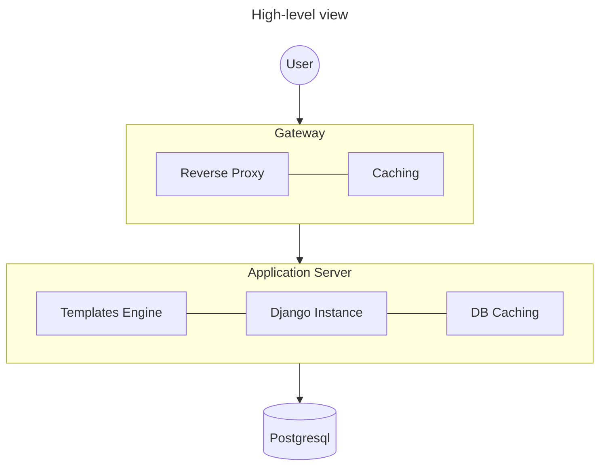
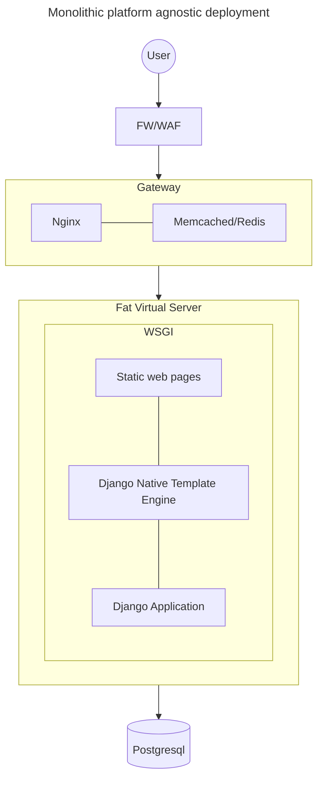
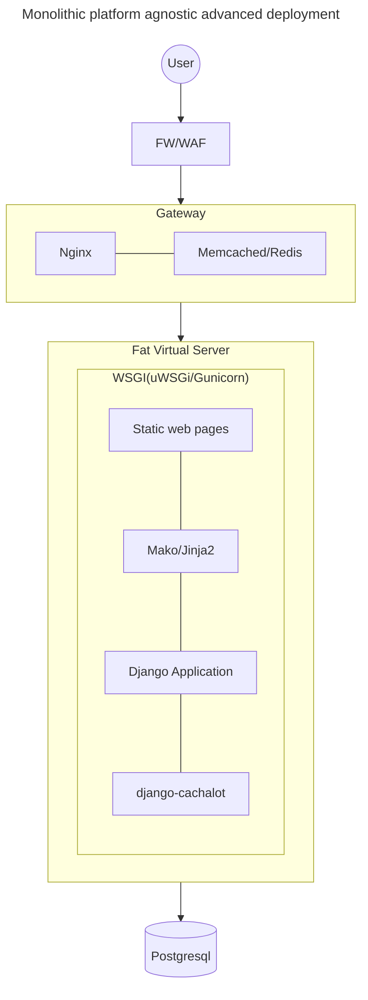
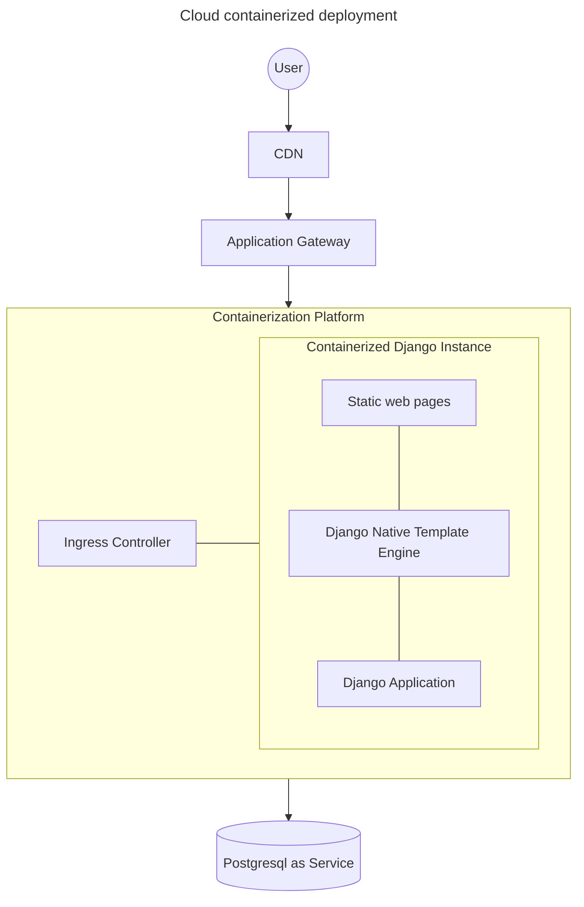
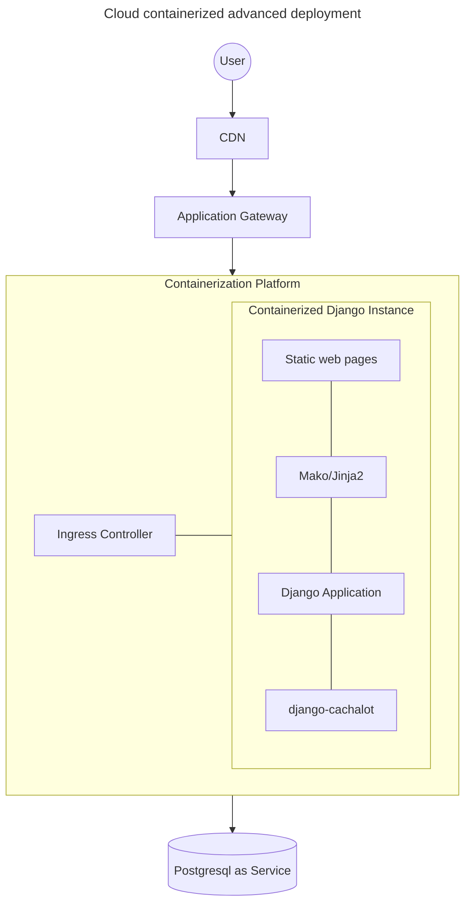
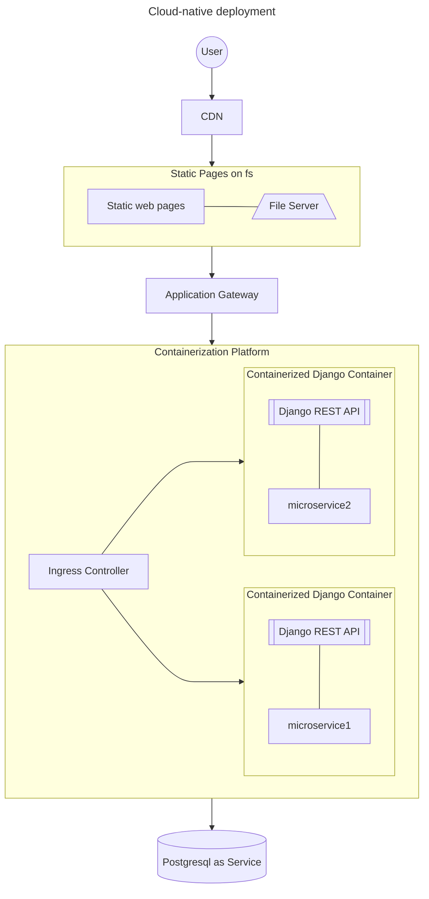

```mermaid
---
title: High-level view
---
flowchart TD

    n1["Reverse Proxy"]
    n2["Caching"]
    n3["Templates Engine"]
    n4["Django Instance"]
    n5["DB Caching"]
n6[("Postgresql")]
    n7(("User"))
    subgraph s1["Gateway"]
n1 --- n2
end
subgraph s2["Application Server"]
n3---n4---n5
end
    n7 --> s1 --> s2 --> n6
```

```mermaid
---
title: Monolithic platform agnostic deployment
---
flowchart TD
n0["FW/WAF"]
    n1["Nginx"]
    n2["Memcached/Redis"]
    n3["Static web pages"]
    n4["Django Native Template Engine"]
    n5["Django Application"]
n6[("Postgresql")]
    n7(("User"))
   
    subgraph s1["Gateway"]
n1 --- n2
end
subgraph s3["WSGI"]
        n3---n4---n5
    end
    subgraph s2["Fat Virtual Server"]
s3
end
   
    n7 --> n0-->s1 --> s2 --> n6
```

```mermaid
---
title: Monolithic platform agnostic advanced deployment
---
flowchart TD
n0["FW/WAF"]
    n1["Nginx"]
    n2["Memcached/Redis"]
    n3["Static web pages"]
    n4["Mako/Jinja2"]
    n5["Django Application"]
    n6["django-cachalot"]
n7[("Postgresql")]
    n8(("User"))
   
    subgraph s1["Gateway"]
n1 --- n2
end
subgraph s3["WSGI(uWSGi/Gunicorn)"]
        n3---n4---n5---n6
    end
    subgraph s2["Fat Virtual Server"]
s3
end
   
    n8 --> n0-->s1 --> s2 --> n7
```

```mermaid
---
title: Cloud containerized deployment
---
flowchart TD
n0(("User"))
    n1["CDN"]
    n2["Application Gateway"]
    n3["Static web pages"]
    n4["Django Native Template Engine"]
    n5["Django Application"]
    n6["Ingress Controller"]
    n7[("Postgresql as Service")]
    subgraph s0["Containerized Django Instance"]
n3---n4---n5
end
    subgraph s1["Containerization Platform"]
        n6---s0
end
n0-->n1-->n2-->s1-->n7    
```

```mermaid
---
title: Cloud containerized advanced deployment
---
flowchart TD
n0(("User"))
    n1["CDN"]
    n2["Application Gateway"]
    n3["Static web pages"]
    n4["Mako/Jinja2"]
    n5["Django Application"]
    n6["django-cachalot"]
    n7["Ingress Controller"]
    n8[("Postgresql as Service")]
    subgraph s0["Containerized Django Instance"]
n3---n4---n5---n6
end
    subgraph s1["Containerization Platform"]
        n7---s0
end
n0-->n1-->n2-->s1-->n8    
```

```mermaid
---
title: Cloud-native deployment
---
flowchart TD
n0(("User"))
    n1["CDN"]
    n2["Application Gateway"]
    n3["Static web pages"]
n4[/"File Server"\]
    n5[["Django REST API"]]
    n6[["Django REST API"]]
    n7["microservice1"]
    n8["microservice2"]
    n9["Ingress Controller"]
    n10[("Postgresql as Service")]

    subgraph s0["Static Pages on fs"]
n3---n4
end
    subgraph s1["Containerized Django Container"]
n5---n7        
end
    subgraph s2["Containerized Django Container"]
n6---n8      
end
    subgraph s3["Containerization Platform"]
        n9---> s1
        n9---> s2
end
n0-->n1-->s0-->n2-->s3-->n10
```

